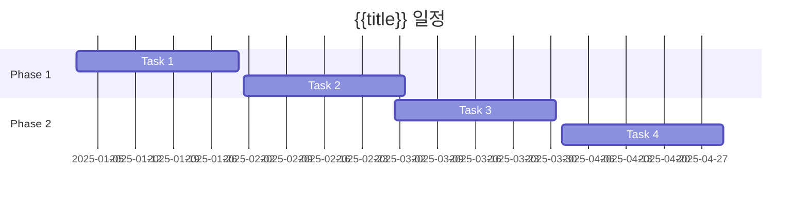

# {{id}}: {{title}}

> [!summary] 과제 요약
> **전략 목표**: {{objective}}
> **우선순위**: {{priority}}
> **상태**: {{status}}
> **책임자**: {{owner}}
> **기간**: {{timeline.start}} ~ {{timeline.end}} ({{timeline.duration}})
> **진척률**: {{progress}}%

## 🎯 과제 개요

### 배경 및 필요성
<!-- 왜 이 과제가 필요한가 -->


### 목표 및 기대효과
<!-- 무엇을 달성하려 하는가 -->

**정량적 목표**
- 목표1: 
- 목표2: 
- 목표3: 

**정성적 목표**
- 목표1: 
- 목표2: 

**기대효과**
- 효과1: 
- 효과2: 

### 범위 (Scope)

**포함 사항 (In-Scope)**
- 
- 
- 

**제외 사항 (Out-of-Scope)**
- 
- 
- 

## 📊 성공 지표

### Key Results (OKR 방식)

**Objective**: {{title}}

| Key Result | 측정 지표 | Target | Current | 달성률 | 기한 |
|------------|----------|--------|---------|--------|------|
| KR1 | 지표명 | 목표 | 현재 | 0% | 날짜 |
| KR2 | 지표명 | 목표 | 현재 | 0% | 날짜 |
| KR3 | 지표명 | 목표 | 현재 | 0% | 날짜 |

### 성공 기준
- [ ] 기준1
- [ ] 기준2
- [ ] 기준3

## 🗓️ 실행 로드맵

### 주요 마일스톤



### Phase 상세

#### Phase 1: 준비/기획 (Week 1-4)
- [ ] **Week 1**: 
  - Task: 
  - Deliverable: 
- [ ] **Week 2**: 
  - Task: 
  - Deliverable: 
- [ ] **Week 3**: 
  - Task: 
  - Deliverable: 
- [ ] **Week 4**: 
  - Task: 
  - Deliverable: 

**Phase 1 완료 기준**: 

#### Phase 2: 실행 (Week 5-8)
- [ ] **Week 5**: 
- [ ] **Week 6**: 
- [ ] **Week 7**: 
- [ ] **Week 8**: 

**Phase 2 완료 기준**: 

#### Phase 3: 검증/개선 (Week 9-12)
- [ ] **Week 9**: 
- [ ] **Week 10**: 
- [ ] **Week 11**: 
- [ ] **Week 12**: 

**Phase 3 완료 기준**: 

## 📋 Action Plans

<!-- 연결된 실행계획들 -->
```dataview
TABLE status, timeline, tasks-completed as "완료 태스크"
FROM "05-Action-Plans"
WHERE contains(initiative, this.file.name)
SORT file.name ASC
```

### 실행계획 요약
- [[05-Action-Plans/AP-XXX-Q1-Plan]] - Q1 실행계획
- [[05-Action-Plans/AP-XXX-Q2-Plan]] - Q2 실행계획

## 👥 팀 구성 및 역할

### 조직도
```
     [{{owner}}]
         |
    +---------+---------+
    |         |         |
 [팀원1]   [팀원2]   [팀원3]
```

### 역할 및 책임 (RACI)

| 활동/Deliverable | R (실행) | A (책임) | C (자문) | I (정보공유) |
|------------------|----------|----------|----------|--------------|
| 활동1 | 팀원1 | {{owner}} | 부서A | 임원 |
| 활동2 | 팀원2 | {{owner}} | 부서B | 임원 |
| 활동3 | 팀원3 | {{owner}} | 부서C | 임원 |

### 팀원 상세

**{{owner}} (책임자)**
- 역할: 
- 투입률: 
- 연락처: 

**팀원1**
- 역할: 
- 투입률: 
- 연락처: 

**팀원2**
- 역할: 
- 투입률: 
- 연락처: 

## 💰 리소스 및 예산

### 예산 계획

| 항목 | 내역 | 금액 | 분기 | 상태 |
|------|------|------|------|------|
| 인건비 | 내부 인력 | ₩ |  | 확정 |
| 외주비 | 외부 용역 | ₩ |  | 협의중 |
| 구매비 | 시스템/도구 | ₩ |  | 확정 |
| 교육비 | 교육 훈련 | ₩ |  | 확정 |
| **합계** | | **₩** | | |

### 인력 계획

| 역할 | 필요 스킬 | 투입 기간 | 투입률 | 상태 |
|------|-----------|----------|--------|------|
| 역할1 | 스킬 | 기간 | 100% | 확보 |
| 역할2 | 스킬 | 기간 | 50% | 협의중 |

### 기술/도구

**필요 기술**
- 기술1: 
- 기술2: 

**필요 도구/시스템**
- 도구1: 
- 도구2: 

**외부 서비스**
- 서비스1: 
- 서비스2: 

## ⚠️ 리스크 및 이슈 관리

### 리스크 등록부

| ID | 리스크 | 확률 | 영향도 | 심각도 | 대응 전략 | 담당자 | 상태 |
|----|--------|------|--------|--------|-----------|--------|------|
| R01 | 리스크1 | H | H | 🔴 | 전략 | 담당자 | Open |
| R02 | 리스크2 | M | H | 🟡 | 전략 | 담당자 | Monitoring |
| R03 | 리스크3 | L | M | 🟢 | 전략 | 담당자 | Closed |

### 현재 이슈

| ID | 이슈 | 영향도 | 담당자 | 기한 | 상태 |
|----|------|--------|--------|------|------|
| I01 | 이슈1 | High | 담당자 | 날짜 | 🔴 Critical |
| I02 | 이슈2 | Med | 담당자 | 날짜 | 🟡 Monitoring |

### 블로커

**현재 블로커**
- [ ] 블로커1 - 해결 방안: 
- [ ] 블로커2 - 해결 방안: 

**해결된 블로커**
- [x] 과거 블로커 - 해결 방법: 

## 🔗 의존성 및 연관성

### 선행 과제
- [[04-Key-Initiatives/KI-XXX]] - 관계 설명
- 외부 의존성: 

### 연관 과제
- [[04-Key-Initiatives/KI-XXX]] - 협업 관계
- [[04-Key-Initiatives/KI-XXX]] - 정보 공유

### 후행 영향
- 이 과제 완료 후 시작 가능한 과제: 
- 영향받는 프로젝트: 

## 📈 진척 추적

### 전체 진척률
```
진척률: {{progress}}%
████████░░░░░░░░░░░░ {{progress}}%
```

### 주간 진척

| 주차 | 계획 활동 | 실제 완료 | 진척률 | 이슈 |
|------|----------|----------|--------|------|
| W1 | 활동 | 완료사항 | 10% | 없음 |
| W2 | 활동 | 완료사항 | 25% | 없음 |
| W3 | 활동 | | 25% | 진행중 |

### 최근 업데이트

**2025-01-08**
- 완료: 
- 진행중: 
- 다음 주: 
- 블로커: 

## 📞 커뮤니케이션

### 정기 회의

**주간 진척 회의**
- 일시: 매주 X요일 YY:00
- 참석자: 
- 안건: 진척 공유, 이슈 해결

**월간 리뷰**
- 일시: 매월 마지막 주 금요일
- 참석자: 
- 안건: 월간 성과, 다음 달 계획

### 보고 체계

**주간 보고**
- 대상: {{owner}} → 팀장
- 형식: 이메일/문서
- 내용: 진척, 이슈, 계획

**월간 보고**
- 대상: 팀장 → 임원
- 형식: 발표 자료
- 내용: 성과, KPI, 리스크

### 이해관계자

| 이해관계자 | 역할 | 관심사항 | 커뮤니케이션 방식 |
|-----------|------|----------|------------------|
| 임원진 | 스폰서 | 전략 정렬, ROI | 월간 보고 |
| 팀장 | 승인자 | 진척, 리스크 | 주간 회의 |
| 협조부서 | 협력자 | 일정, 리소스 | 수시 |

## 📚 관련 문서

### 기획 문서
- [[문서명]] - 사업계획서
- [[문서명]] - 요구사항 정의서

### 산출물
- [[문서명]] - 설계서
- [[문서명]] - 개발 가이드

### 참고 자료
- 외부 링크1
- 외부 링크2

## 💡 교훈 및 인사이트

### What Went Well (잘된 점)
- 

### What Didn't Go Well (개선점)
- 

### Action Items for Next Time
- 

### 베스트 프랙티스
- 

## 🎉 성과 및 결과

### 최종 성과 (완료 시 작성)

**정량적 성과**
- KR1 달성률: 
- KR2 달성률: 
- KR3 달성률: 

**정성적 성과**
- 

**임팩트**
- 비즈니스: 
- 조직: 
- 개인: 

### 후속 과제
- [[04-Key-Initiatives/KI-XXX]] - 차기 과제

---

## 📋 체크리스트

### 시작 전
- [ ] 과제 정의 및 범위 확정
- [ ] 목표 및 KR 설정
- [ ] 팀 구성 완료
- [ ] 예산 승인
- [ ] 리스크 식별
- [ ] 킥오프 미팅

### 실행 중
- [ ] 주간 진척 업데이트
- [ ] 이슈 관리
- [ ] 정기 회의 진행
- [ ] 이해관계자 커뮤니케이션
- [ ] 중간 검토

### 완료 시
- [ ] 최종 성과 측정
- [ ] 산출물 정리
- [ ] 교훈 문서화
- [ ] 완료 보고
- [ ] 후속 과제 제안

---

**작성자**: 
**작성일**: {{date:YYYY-MM-DD}}
**최종 수정**: {{date:YYYY-MM-DD}}
**검토자**: 
**승인자**: 
**승인일**: 
